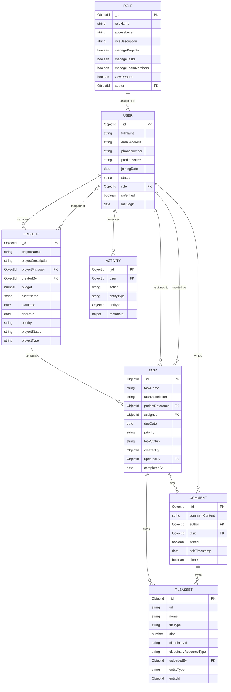

# TeamPulse

TeamPulse is an enterprise project management platform built on the MERN stack. It provides real-time team collaboration through WebSocket integration, a role-based access control system with three distinct permission tiers, and a Cloudinary CDN pipeline for secure file management.

---

## Table of Contents

1. [Architectural Overview](#architectural-overview)
2. [Technology Stack](#technology-stack)
3. [Database Schema](#database-schema)
4. [Core Workflows and RBAC](#core-workflows-and-rbac)
5. [Prerequisites](#prerequisites)
6. [Environment Variables](#environment-variables)
7. [Installation and Setup](#installation-and-setup)
8. [Running the Application](#running-the-application)
9. [API Reference](#api-reference)
10. [Security Model](#security-model)

---

## Architectural Overview

TeamPulse follows a three-tier client-server architecture with an event-driven layer for real-time synchronization.

```
Client (React + Zustand)
        |
        | HTTP REST (Axios)        WebSocket (Socket.io-client)
        |                                    |
        v                                    v
Express REST API <-----------> Socket.io Server (shared io instance)
        |                                    |
        v                                    |
  MongoDB (Mongoose ODM)                     |
        |                                    |
        v                                    |
  Cloudinary CDN  <-----------------------  |
  (Multer upload pipeline)
```

### Request Lifecycle

1. A client action (create task, post comment) triggers an Axios HTTP call to the Express REST API.
2. The `protectRoute` middleware validates the JWT from the HTTP-only cookie and populates `req.dbUser` with the full user document including the populated `role` object.
3. The `requirePermission` middleware checks the boolean flag on `req.dbUser.role` (e.g., `manageTasks`, `manageProjects`). Controller functions perform a second ownership check to prevent lateral privilege escalation.
4. On success, the controller persists the document to MongoDB, then calls `getIO().to(roomId).emit(event, payload)` to broadcast the change to all clients subscribed to the project room.
5. React clients receive the socket event and update Zustand state or local component state, making the change visible to all connected users without a page reload.

### WebSocket Room Model

Each project has its own Socket.io room identified by the project's MongoDB ObjectId. Clients join the room on `ProjectBoard` mount and leave on unmount. All real-time events (`task-created`, `task-updated`, `new-comment`, `comment-edited`, `comment-deleted`) are scoped to the project room, preventing cross-project data leakage.

### Cloudinary CDN Pipeline

File uploads follow a two-step process:

1. The client posts the binary to `/api/files/upload` as `multipart/form-data`. Multer processes the stream in memory (no disk write).
2. The backend streams the buffer to Cloudinary using the Node.js SDK. Cloudinary returns a secure URL and a `public_id`.
3. A `FileAsset` document is saved in MongoDB with the Cloudinary URL, resource type, and a polymorphic reference (`entityType`, `entityId`) linking the asset to its parent (Task, Comment, Project, or User).
4. Deletion calls the Cloudinary Destroy API with the stored `cloudinaryId` and `cloudinaryResourceType`, then removes the `FileAsset` document.

---

## Technology Stack

| Layer | Technology | Version |
|---|---|---|
| Frontend framework | React | 18 |
| State management | Zustand | 4 |
| Styling | Tailwind CSS | 4 |
| Animation | Framer Motion | 11 |
| HTTP client | Axios | 1.6 |
| WebSocket client | Socket.io-client | 4.7 |
| Backend framework | Express | 5 |
| Database | MongoDB + Mongoose | 8 |
| WebSocket server | Socket.io | 4.7 |
| File upload | Multer + Cloudinary SDK | - |
| Authentication | JWT (HTTP-only cookie) | - |
| Build tool | Vite | 8 |

---

## Database Schema



---

## Core Workflows and RBAC

### Role Definitions

| Role | manageProjects | manageTasks | manageTeamMembers | viewReports | Notes |
|---|---|---|---|---|---|
| Admin | true | true | true | true | Full system access; bypasses ownership checks |
| Project Manager | true | true | false | true | Full access scoped to owned projects |
| Team Member | false | true | false | false | Read/write access scoped to assigned projects |
| Stakeholder | false | false | false | true | Read-only access |

### Authorization Model

Authorization is enforced at two levels:

**Route level:** The `requirePermission(flag)` middleware checks the boolean permission flag on the user's role document. A request without the required flag receives a `403` response before reaching the controller. This prevents horizontal escalation (e.g., a Team Member calling a project management endpoint).

**Controller level:** Controllers perform an ownership check after the route-level permission passes. For example, `updateProject` verifies that `req.dbUser._id` matches `project.projectManager` or that the user is an Admin. This prevents vertical escalation (e.g., a Project Manager modifying another manager's project). Similarly, `updateTask` and `deleteTask` verify that the requesting user belongs to the task's parent project.

### Workflow: Project Lifecycle

1. A user with `manageProjects = true` creates a project. They are automatically set as the `projectManager`.
2. The Project Manager adds team members to `assignedTeamMembers` via the Manage Team modal.
3. Any user with `manageTasks = true` who belongs to the project (Admin, Project Manager, or assigned Team Member) can create tasks.
4. Only the Project Manager or an Admin can update or delete the project itself.
5. Only the Project Manager or an Admin can delete tasks. Any project member can update task status.
6. Deleting a project triggers a cascade: all associated tasks and their comments are removed from MongoDB.

### Workflow: Real-Time Kanban Board

1. On `ProjectBoard` mount, `useSocket(projectId)` establishes a Socket.io connection and emits `join-project` to subscribe to the project room.
2. Task status updates via drag-and-drop call `PATCH /api/tasks/:id` with the new status. The controller emits `task-updated` to the project room.
3. All connected clients receive `task-updated` and update their local task list without a reload.
4. On unmount, the hook emits `leave-project` and calls `socket.disconnect()`. A `useRef` guard ensures the previous socket is torn down before a new one is created if the project changes rapidly, preventing accumulation of stale connections.

### Workflow: Task Comment System

1. A user submits a comment. An optimistic entry with a `temp-` prefixed ID is inserted into local state immediately for perceived performance.
2. `POST /api/comments/task/:taskId` is called. The backend verifies project membership, saves the comment, and emits `new-comment` to the project room.
3. On HTTP success, the component replaces the optimistic entry with the persisted document (carrying the real MongoDB `_id`).
4. When the socket broadcast arrives, the handler checks whether the real `_id` already exists in state and discards the event if it does, preventing duplicate entries regardless of message content.
5. On HTTP failure, the optimistic comment is removed, the text input is restored, and an inline error message is displayed.
6. Comment deletion uses an optimistic-remove-then-rollback pattern: the comment is removed from state before the API call, and restored in the correct chronological position if the request fails.

---

## Prerequisites

- Node.js 18 or higher
- npm 9 or higher
- MongoDB 6 or higher (local instance or MongoDB Atlas)
- A Cloudinary account (free tier is sufficient for development)

---

## Environment Variables

### Backend (`backend/.env`)

```
PORT=5001
MONGO_URI=mongodb://localhost:27017/teampulse
JWT_SECRET=<minimum 32 character random string>
CLOUDINARY_CLOUD_NAME=<your cloudinary cloud name>
CLOUDINARY_API_KEY=<your cloudinary api key>
CLOUDINARY_API_SECRET=<your cloudinary api secret>
NODE_ENV=development
```

### Frontend (`frontend/.env`)

```
VITE_API_BASE_URL=http://localhost:5001/api
```

---

## Installation and Setup

### 1. Clone the Repository

```bash
git clone https://github.com/Robert2101/TeamPulse.git
cd TeamPulse
```

### 2. Install Backend Dependencies

```bash
cd backend
npm install
```

### 3. Install Frontend Dependencies

```bash
cd ../frontend
npm install
```

### 4. Configure Environment Variables

Create `backend/.env` and `frontend/.env` using the templates in the [Environment Variables](#environment-variables) section above.

### 5. Seed Initial Roles (Optional)

The application requires at least one `Role` document with `roleName: "Admin"` to bootstrap the first user. Connect to your MongoDB instance and insert the following documents into the `roles` collection:

```javascript
db.roles.insertMany([
  {
    roleName: "Admin",
    accessLevel: "Admin",
    roleDescription: "Full system administrator with unrestricted access.",
    manageProjects: true,
    manageTasks: true,
    manageTeamMembers: true,
    viewReports: true
  },
  {
    roleName: "Project Manager",
    accessLevel: "Editor",
    roleDescription: "Manages projects and tasks within assigned scope.",
    manageProjects: true,
    manageTasks: true,
    manageTeamMembers: false,
    viewReports: true
  },
  {
    roleName: "Team Member",
    accessLevel: "Editor",
    roleDescription: "Contributes to assigned projects and tasks.",
    manageProjects: false,
    manageTasks: true,
    manageTeamMembers: false,
    viewReports: false
  }
])
```

---

## Running the Application

### Development Mode

Open two terminal sessions from the repository root.

**Terminal 1 — Backend:**

```bash
cd backend
npm run dev
```

The Express server starts on `http://localhost:5001`. Socket.io shares this port.

**Terminal 2 — Frontend:**

```bash
cd frontend
npm run dev
```

The Vite development server starts on `http://localhost:5173`.

### Production Build

```bash
cd frontend
npm run build
```

The compiled static assets are placed in `frontend/dist`. Configure your web server (nginx, Caddy) to serve `dist/index.html` for all routes and proxy `/api` and `/socket.io` requests to the backend process.

---

## API Reference

All endpoints require a valid JWT cookie unless noted otherwise.

### Authentication

| Method | Path | Description |
|---|---|---|
| POST | `/api/auth/register` | Register a new user account |
| POST | `/api/auth/login` | Authenticate and receive JWT cookie |
| POST | `/api/auth/logout` | Invalidate the JWT cookie |

### Projects

| Method | Path | Permission | Description |
|---|---|---|---|
| GET | `/api/projects` | Authenticated | List accessible projects |
| GET | `/api/projects/:id` | Authenticated, member | Get project details |
| POST | `/api/projects` | manageProjects | Create a project |
| PUT | `/api/projects/:id` | manageProjects + owner | Update a project |
| DELETE | `/api/projects/:id` | manageProjects + owner | Delete a project (cascade) |

### Tasks

| Method | Path | Permission | Description |
|---|---|---|---|
| GET | `/api/tasks/project/:projectId` | Authenticated, member | List tasks for a project |
| POST | `/api/tasks` | manageTasks, member | Create a task |
| PATCH | `/api/tasks/:id` | manageTasks, member | Update a task |
| DELETE | `/api/tasks/:id` | manageTasks, manager/admin | Delete a task (cascade) |

### Comments

| Method | Path | Permission | Description |
|---|---|---|---|
| GET | `/api/comments/task/:taskId` | Authenticated, member | Get comments for a task |
| POST | `/api/comments/task/:taskId` | Authenticated, member | Post a comment |
| PATCH | `/api/comments/:id` | Authenticated, author/admin | Edit a comment |
| DELETE | `/api/comments/:id` | Authenticated, author/admin | Delete a comment |

### File Assets

| Method | Path | Description |
|---|---|---|
| POST | `/api/files/upload` | Upload a file to Cloudinary |
| GET | `/api/files/:entityType/:entityId` | List assets for an entity |
| DELETE | `/api/files/:id` | Delete a file from Cloudinary and MongoDB |

---

## Security Model

### Authentication

Sessions are managed with JWT tokens stored in HTTP-only, `SameSite=Strict` cookies. Tokens are never exposed to JavaScript, eliminating XSS-based token theft.

### Authorization

- **Route layer:** `requirePermission(flag)` middleware blocks requests missing the required role permission before controller logic runs.
- **Controller layer:** Ownership checks verify the requesting user is the project manager, task owner, or comment author (or Admin) before any write operation is executed. This dual-layer approach ensures that a permission grant on the role does not automatically confer access to all resources of that type.

### Password Storage

User passwords are hashed with bcrypt before persistence. Plain-text passwords are never stored or logged.

### Input Validation

Mongoose schema validators enforce field types, enum values, required fields, and string length limits at the database layer. Express controllers validate required fields before database operations.

### File Upload Security

Multer is configured with MIME type filtering and file size limits. Files are streamed directly to Cloudinary and never written to the server filesystem. Cloudinary public IDs are stored to enable accurate deletion without relying on URL parsing.
