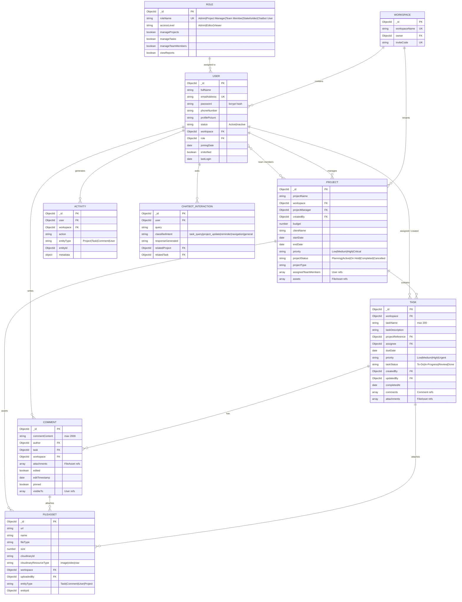

# TeamPulse

**Real-time, multi-tenant project management platform built on the MERN stack.**

TeamPulse lets organizations run their entire delivery operation inside isolated workspaces: role-based teams collaborate on live Kanban boards, discuss tasks in real time, manage files on a Cloudinary pipeline, and get answers from an AI assistant that reads — and safely acts on — their actual project data. Every layer is hardened for tenancy isolation, dual-layer RBAC, and performance under load.

> Ditch the chaos. Experience project management that breathes with your team.

---

## Table of Contents

1. [Features](#features)
2. [Architecture](#architecture)
3. [Technology Stack](#technology-stack)
4. [Multi-Tenancy & RBAC](#multi-tenancy--rbac)
5. [Database Schema](#database-schema)
6. [Real-Time Events](#real-time-events)
7. [API Reference](#api-reference)
8. [Caching & Rate Limiting](#caching--rate-limiting)
9. [AI Assistant](#ai-assistant)
10. [Security Model](#security-model)
11. [Prerequisites](#prerequisites)
12. [Environment Variables](#environment-variables)
13. [Installation & Setup](#installation--setup)
14. [Running the Application](#running-the-application)
15. [Load Testing](#load-testing)
16. [Project Structure](#project-structure)

---

## Features

### 🏢 Multi-Tenant Workspaces
- Two signup paths: **create a workspace** (creator becomes Admin) or **join via invite code** (joins land on the least-privileged Stakeholder role).
- Auto-generated 6-character invite codes, surfaced in Settings with one-click copy.
- Every document — project, task, comment, file, activity — carries a `workspace` reference, and queries are tenant-scoped at the controller layer.

### 🔐 Four-Tier Role-Based Access Control
- Roles: **Admin**, **Project Manager**, **Team Member**, **Stakeholder**, each mapped to granular permission flags (`manageProjects`, `manageTasks`, `manageTeamMembers`, `viewReports`).
- Route-level enforcement (`requirePermission` middleware) plus controller-level ownership checks — a permission flag never grants access to resources outside your scope.
- Sensitive fields like `budget` are stripped from API responses for non-managers.

### ⚡ Real-Time Collaboration (Socket.IO)
- JWT-authenticated WebSocket handshakes; deactivated users are rejected mid-handshake.
- Per-project rooms with server-side membership verification before join (workspace + role + membership checks).
- Live Kanban sync (`task-created` / `task-updated` / `task-deleted`), comment streaming, file events, and **typing indicators**.
- Drag-and-drop board updates with optimistic UI and rollback-on-failure.

### 💬 Task Detail Panel
- Split view: description & status on the left, live discussion on the right.
- Comments with optimistic posting (`temp-` IDs), race-safe deduplication when socket events beat HTTP responses, inline editing/deletion with rollback, pinning, and image previews.
- Attachments per task *and* per comment.

### 🤖 AI Assistant (Gemini 2.5 Flash)
- Token-streamed responses over Server-Sent Events with conversation memory.
- Grounded strictly in the requesting user's own live projects/tasks — anti-hallucination and prompt-injection rules baked into the system instruction.
- **Function calling**: the model can execute `update_task_status`, scoped to tasks the caller is actually assigned to, with full side effects (cache invalidation, socket broadcast, activity log).
- Persistent interaction history (`ChatbotInteraction`) with intent classification.

### 📁 File Management (Cloudinary Pipeline)
- Drag-and-drop uploads (react-dropzone) → Multer memory storage → streamed to Cloudinary (never touches disk).
- Polymorphic `FileAsset` records attachable to Tasks, Comments, Projects, or User avatars — with IDOR protection on each target type.
- Accurate deletion via stored `public_id` + resource type, mirrored back to parent documents.

### 📊 Dashboards, Audit & Administration
- Admin command center: workspace-wide task KPIs (cached aggregate endpoint) and project directory.
- Personal desk: individual pending/completed/urgent queues.
- Audit Log timeline with entity-type filters, relative timestamps, and admin-only raw-ID inspection on hover.
- Settings: profile editing, avatar upload, invite-code sharing, and admin-only user role/activation management.

### 🚀 Performance Engineering
- Fail-open **Upstash Redis** layer: session caching (15 min), query caching with a write-Mongo-first/invalidate-Redis-second funnel, and per-workspace bulk invalidation via tracked key SETs (no `KEYS *` scans).
- Sliding-window rate limiting on auth, chatbot, and file routes.
- Validated by an **11-scenario k6 load-test suite** including a Redis ON/OFF A/B methodology ([tests/load/k6](tests/load/k6)).

---

## Architecture

Three-tier client–server architecture with an event-driven real-time layer:

```
Client (React 18 + Zustand + Vite)
        │
        │ HTTP REST (Axios, cookie auth)      WebSocket (socket.io-client)
        │                                               │
        ▼                                               ▼
Express 5 REST API  ◄──── shared io instance ────►  Socket.IO Server
   │          │                                        │
   │          ├── protectRoute (JWT cookie → Redis session cache)
   │          └── requirePermission (RBAC flags)       │
   ▼                                                   │
MongoDB (Mongoose 9, tenant-scoped)                    │
   │                                                   │
   ▼                                                   │
Upstash Redis (cache + sliding-window rate limits)     │
   ◄────────────── cache invalidation funnel ──────────┘
        │
        ▼
Cloudinary CDN  ◄── Multer memory-stream uploads
        │
        ▼
Gemini 2.5 Flash  (SSE streaming + function calling)
```

### Request Lifecycle

1. A client action calls the Express API via Axios with the JWT httpOnly cookie attached (`withCredentials`).
2. `protectRoute` verifies the JWT, resolves the user through the Redis session cache (`session:user:<id>`, 15 min TTL, MongoDB fallback), populates `req.dbUser` with role + workspace, and rejects deactivated accounts.
3. `requirePermission(flag)` checks the boolean flag on the populated role document before any controller runs.
4. The controller re-verifies ownership/membership within the workspace, persists to MongoDB, then **invalidates affected Redis keys** and broadcasts a Socket.IO event to the project room.
5. Connected clients patch local state instantly — no refetch, no reload.

### WebSocket Room Model

Each project owns a room keyed by its Mongo `_id`. Clients join via `useSocket(projectId)` on mount and leave on unmount; the hook tears down stale sockets when switching projects rapidly. Room joins are authorized server-side: the socket's user must belong to the project's workspace *and* be its manager or a member (or Admin). Cross-workspace join attempts are logged and rejected.

### Cloudinary Upload Pipeline

1. Client posts `multipart/form-data` to `/api/files/upload`; Multer validates MIME type and size (50 MB) entirely in memory.
2. The buffer streams to Cloudinary (`teampulse/<entity-type>s` folders, `resource_type: auto`).
3. A `FileAsset` document stores the secure URL, `public_id`, resource type, uploader, and a polymorphic `(entityType, entityId)` reference; the parent document gets the asset pushed onto its array.
4. Deletion calls `cloudinary.uploader.destroy` with the stored ID/resource type, `$pull`s references from parents, and broadcasts `file-deleted`.

---

## Technology Stack

### Backend

| Layer | Technology | Version |
|---|---|---|
| Runtime | Node.js (ESM) | ≥ 18 |
| Framework | Express | 5.x |
| Database / ODM | MongoDB + Mongoose | Mongoose 9.x |
| Real-time | Socket.IO | 4.8.x |
| Auth | jsonwebtoken (JWT in httpOnly cookie) + bcryptjs | jwt 9.x, bcryptjs 3.x |
| Cache / rate limiting | Upstash Redis (REST) + @upstash/ratelimit (sliding window) | redis 1.38, ratelimit 2.x |
| AI | @google/genai — Gemini 2.5 Flash, streaming + function calling | 1.45.x |
| Files | Multer (memory storage) + Cloudinary SDK v2 | multer 2.x, cloudinary 2.9 |
| Logging | Winston (dev: pretty console + file transports / prod: JSON stdout) + Morgan HTTP logging | winston 3.19 |
| Utilities | cors, cookie-parser, dotenv, express-rate-limit | — |
| Dev tooling | Nodemon | 3.x |

### Frontend

| Layer | Technology | Version |
|---|---|---|
| Framework | React (functional components + hooks) | 18.2 |
| Routing | React Router DOM (nested protected layout) | 6.20 |
| State | Zustand (global auth/project store) | 4.4 |
| Build tool | Vite + @vitejs/plugin-react | 8.x |
| Styling | Tailwind CSS v4 (`@tailwindcss/vite` plugin) + tw-animate-css | 4.2 |
| UI primitives | Radix UI (shadcn/ui pattern) + class-variance-authority + clsx/tailwind-merge | radix-ui 1.4 |
| Icons | lucide-react | 0.300 |
| HTTP | Axios (401 interceptor → auto-logout) + native fetch (SSE chat stream) | 1.6 |
| Real-time client | socket.io-client (custom `useSocket` hook) | 4.7 |
| File drops | react-dropzone | 15.x |
| Landing animations | ogl (WebGL shader hero) + lenis (smooth-scroll stack) — via react-bits | ogl 1.0, lenis 1.3 |
| Linting | ESLint 9 flat config + react-hooks/react-refresh plugins | 9.x |

### Testing & Deployment

| Area | Tooling |
|---|---|
| Load testing | k6 (Grafana Labs) — 11 scenarios, custom `tp_*` metrics, threshold presets |
| Frontend hosting | Vercel-ready SPA config (`vercel.json` rewrites) |

---

## Multi-Tenancy & RBAC

### Role Permission Matrix (as seeded)

| Role | manageProjects | manageTasks | manageTeamMembers | viewReports |
|---|---|---|---|---|
| **Admin** | ✅ | ✅ | ✅ | ✅ |
| **Project Manager** | ✅ | ✅ | ✅ | ✅ |
| **Team Member** | ❌ | ✅ | ❌ | ✅ |
| **Stakeholder** | ❌ | ❌ | ❌ | ✅ |

### Dual-Layer Authorization

**Layer 1 — Route middleware.** `requirePermission('manageProjects')` returns `403` before the controller if the user's role lacks the flag. This stops horizontal escalation (a Team Member hitting management endpoints).

**Layer 2 — Controller ownership checks.** Passing the flag doesn't grant global power. Examples enforced in controllers:

- `updateProject` / `deleteProject`: only the project's manager or an Admin.
- `updateTask`: any project member may move status; only Admin/PM may change name, description, assignee, due date, priority, or parent project (other fields are stripped from the payload).
- `deleteTask` / `deleteComment`: manager/Admin and author/Admin respectively.
- File operations resolve the target's parent project and verify membership before serving or deleting.
- Cross-workspace access on any resource returns `403` and is logged as a security alert.

### Anti-Mass-Assignment Protection (S-04)

Update handlers strip protected fields (`_id`, `__v`, `workspace`, `createdBy`, `createdAt`) from request bodies; only Admins may reassign a project's manager. Team-member additions are resolved through per-user workspace validation — emails are looked up and must belong to the caller's workspace.

### Core Workflows

**Project lifecycle**
1. A user with `manageProjects` creates a project and becomes its `projectManager`.
2. They add members via the Manage Team modal (email-based, validated against the workspace).
3. Any member with `manageTasks` can create and progress tasks.
4. Only the manager/Admin can edit or delete the project — deletion cascades through tasks and their comments.

**Kanban flow**
1. Board mount opens a socket connection and joins the project room.
2. Drag-and-drop optimistically moves the card, then `PATCH /api/tasks/:id`.
3. On failure the board refetches and restores; on success the server broadcasts `task-updated` to everyone.
4. Setting status to `Done` stamps `completedAt` automatically.

**Comment flow**
1. Submitting inserts an optimistic `temp-` entry immediately.
2. `POST /api/comments/task/:taskId` persists; the temp entry swaps for the real document.
3. If the socket broadcast arrives first (or duplicates), handlers dedupe strictly by `_id` — identical text from two users can never collide.
4. Failure rolls back the entry, restores the input text, and surfaces an inline error.

---

## Database Schema


```mermaid
erDiagram
    WORKSPACE {
        ObjectId _id PK
        string workspaceName UK
        ObjectId owner FK
        string inviteCode UK
    }

    ROLE {
        ObjectId _id PK
        string roleName UK "Admin|Project Manager|Team Member|Stakeholder|Chatbot User"
        string accessLevel "Admin|Editor|Viewer"
        boolean manageProjects
        boolean manageTasks
        boolean manageTeamMembers
        boolean viewReports
    }

    USER {
        ObjectId _id PK
        string fullName
        string emailAddress UK
        string password "bcrypt hash"
        string phoneNumber
        string profilePicture
        string status "Active|Inactive"
        ObjectId workspace FK
        ObjectId role FK
        date joiningDate
        boolean isVerified
        date lastLogin
    }

    PROJECT {
        ObjectId _id PK
        string projectName
        ObjectId workspace FK
        ObjectId projectManager FK
        ObjectId createdBy FK
        number budget
        string clientName
        date startDate
        date endDate
        string priority "Low|Medium|High|Critical"
        string projectStatus "Planning|Active|On Hold|Completed|Cancelled"
        string projectType
        array assignedTeamMembers "User refs"
        array assets "FileAsset refs"
    }

    TASK {
        ObjectId _id PK
        ObjectId workspace FK
        string taskName "max 200"
        string taskDescription
        ObjectId projectReference FK
        ObjectId assignee FK
        date dueDate
        string priority "Low|Medium|High|Urgent"
        string taskStatus "To-Do|In-Progress|Review|Done"
        ObjectId createdBy FK
        ObjectId updatedBy FK
        date completedAt
        array comments "Comment refs"
        array attachments "FileAsset refs"
    }

    COMMENT {
        ObjectId _id PK
        string commentContent "max 2000"
        ObjectId author FK
        ObjectId task FK
        ObjectId workspace FK
        array attachments "FileAsset refs"
        boolean edited
        date editTimestamp
        boolean pinned
        array visibleTo "User refs"
    }

    FILEASSET {
        ObjectId _id PK
        string url
        string name
        string fileType
        number size
        string cloudinaryId
        string cloudinaryResourceType "image|video|raw"
        ObjectId workspace FK
        ObjectId uploadedBy FK
        string entityType "Task|Comment|User|Project"
        ObjectId entityId
    }

    ACTIVITY {
        ObjectId _id PK
        ObjectId user FK
        ObjectId workspace FK
        string action
        string entityType "Project|Task|Comment|User"
        ObjectId entityId
        object metadata
    }

    CHATBOT_INTERACTION {
        ObjectId _id PK
        ObjectId user FK
        string query
        string classifiedIntent "task_query|project_update|reminder|navigation|general"
        string responseGenerated
        ObjectId relatedProject FK
        ObjectId relatedTask FK
    }

    WORKSPACE ||--o{ USER : "contains"
    ROLE ||--o{ USER : "assigned to"
    WORKSPACE ||--o{ PROJECT : "tenants"
    USER ||--o{ PROJECT : "manages"
    PROJECT }o--o{ USER : "team members"
    PROJECT ||--o{ TASK : "contains"
    USER ||--o{ TASK : "assigned / created"
    TASK ||--o{ COMMENT : "has"
    USER ||--o{ COMMENT : "writes"
    TASK ||--o{ FILEASSET : "attaches"
    COMMENT ||--o{ FILEASSET : "attaches"
    PROJECT ||--o{ FILEASSET : "assets"
    USER ||--o{ ACTIVITY : "generates"
    USER ||--o{ CHATBOT_INTERACTION : "asks"
```

Indexes: unique on `User.emailAddress`, `Workspace.workspaceName`, `Workspace.inviteCode`, `Role.roleName`; compound index on `Comment (task, createdAt)`; indexed foreign keys across all collections.

---

## Real-Time Events

All events are scoped to project rooms.

| Direction | Event | Payload |
|---|---|---|
| Client → Server | `join-project` / `leave-project` | `projectId` (join is authorization-checked) |
| Client → Server | `typing` / `stop-typing` | `{ projectId, taskId, userName }` |
| Server → Client | `task-created` | populated task document |
| Server → Client | `task-updated` | populated task document |
| Server → Client | `task-deleted` | `{ taskId }` |
| Server → Client | `new-comment` | `{ taskId, comment }` |
| Server → Client | `comment-edited` | updated comment document |
| Server → Client | `comment-deleted` | `commentId` |
| Server → Client | `file-uploaded` / `file-deleted` | `{ entityType, entityId, file \| fileId }` |
| Server → Client | `user-typing` / `user-stop-typing` | relayed typing indicator |
| Server → Client | `error` | rejection reason (unauthorized room join, etc.) |

---

## API Reference

All endpoints require the JWT cookie except `signup`, `login`, and `logout`. Base path: `/api`.

### Authentication — `/auth`

| Method | Path | Notes |
|---|---|---|
| POST | `/signup` | Body: `fullName`, `emailAddress`, `password` + either `isCreatingWorkspace: true, workspaceName` or `inviteCode`. Rate-limited 10 req / 15 min / IP |
| POST | `/login` | Sets JWT httpOnly cookie (24 h). Rate-limited 10 req / 15 min / IP |
| POST | `/logout` | Clears cookie + invalidates Redis session cache |
| GET | `/check-auth` | Returns hydrated user (role + workspace populated) |
| PUT | `/profile` | Update name/email/phone/password |
| GET | `/workspace/users` | All users in your workspace |
| PUT | `/workspace/users/:userId/role` | Admin only; cannot modify own role |
| PUT | `/workspace/users/:userId/status` | Admin only; Active ⇄ Inactive; cannot deactivate self |

### Projects — `/projects`

| Method | Path | Permission |
|---|---|---|
| GET | `/` | Authenticated — own/member projects, or all for Admin. Budget hidden for non-managers |
| GET | `/:id` | Authenticated + workspace member. 90 s Redis cache |
| POST | `/` | `manageProjects` |
| PUT | `/:id` | `manageProjects` + owner (Admin may reassign PM) |
| DELETE | `/:id` | `manageProjects` + owner. Cascades tasks + comments |

### Tasks — `/tasks`

| Method | Path | Permission |
|---|---|---|
| POST | `/` | `manageTasks` + project membership |
| GET | `/project/:projectId` | Membership required. 30 s Redis cache |
| GET | `/stats` | Workspace-wide status counts (cached 45 s) |
| GET | `/mine` | Tasks assigned to caller |
| PATCH | `/:id` | `manageTasks` + membership. Non-managers limited to status changes |
| DELETE | `/:id` | Manager/Admin only. Cascades comments |

### Comments — `/comments`

| Method | Path | Permission |
|---|---|---|
| POST | `/task/:taskId` | Project member |
| GET | `/task/:taskId` | Project member |
| PATCH | `/:id` | Author or Admin (content and/or `pinned`) |
| DELETE | `/:id` | Author or Admin |

### Files — `/files`

| Method | Path | Notes |
|---|---|---|
| POST | `/upload` | multipart `file` + `entityType` (`Task`\|`Comment`\|`Project`\|`User`) + `entityId`. 30 req / 15 min / IP. Target validated for workspace + membership; avatars force `entityId` to caller |
| GET | `/?entityType=&entityId=` | Lists assets for an entity after project-membership check |
| DELETE | `/:fileId` | Uploader or Admin; destroys Cloudinary asset + detaches references |

### Activity — `/activities`

| Method | Path | Notes |
|---|---|---|
| GET | `/:entityId` | Audit trail for a project (resolves its tasks/comments). Latest 100, 30 s cache, membership required |

### AI Assistant — `/chatbot`

| Method | Path | Notes |
|---|---|---|
| POST | `/ask` | SSE stream (`data: {"textChunk": …}`, ends `data: [DONE]`). 20 req / hr / user. May invoke `update_task_status` |
| GET | `/history` | Last 20 interactions, replay-ready format |

---

## Caching & Rate Limiting

Upstash Redis powers both systems. Everything is **fail-open**: without credentials (or on Redis errors) requests fall straight through to MongoDB and rate limits pass — ideal for local development and A/B testing.

### Cache Keys & TTLs

| Key | TTL | Invalidated by |
|---|---|---|
| `session:user:<id>` | 900 s | Logout, role change, status change, profile update |
| `projects:list:<ws>:<admin\|uid>` | 60 s | Any project/task mutation in the workspace |
| `project:<ws>:<pid>` | 90 s | Project/task mutations touching that project |
| `tasks:project:<pid>` | 30 s | Task/comment/file mutations in the project |
| `dash:stats:<ws>` | 45 s | Any task mutation |
| `activity:<pid>` | 30 s | Mutations logged against the project |

Writes follow a strict order: **persist to MongoDB first, invalidate Redis second**. Workspace-level keys are tracked in a `ws:keys:<wsId>` SET (24 h safety TTL) enabling bulk invalidation without dangerous `KEYS *` scans.

### Rate Limits (sliding window, Upstash Ratelimit)

| Scope | Limit | Identifier |
|---|---|---|
| Auth endpoints | 10 / 15 min | IP |
| Chatbot `/ask` | 20 / 1 h | User ID |
| File uploads | 30 / 15 min | IP |
| File reads/deletes | 100 / 15 min | IP |

---

## AI Assistant

`POST /api/chatbot/ask` streams responses from **Gemini 2.5 Flash** (temperature 0.2) over SSE:

- **Grounding** — the system instruction embeds only the caller's own active projects and pending tasks (formatted summaries, never raw dumps), with explicit anti-hallucination and prompt-injection defenses.
- **Memory** — the last 4 persisted interactions are replayed as conversation context; up to 20 are retrievable via `/history`.
- **Function calling** — the model can invoke `update_task_status(taskId, newStatus)`. Execution is guarded by `findOneAndUpdate({ _id, assignee: userId, workspace })`, so the AI can never touch someone else's tasks or cross tenants. Successful tool runs propagate the full side-effect chain: cache invalidation, `task-updated` broadcast, and activity logging with `source: 'chatbot'`.
- **Persistence** — every exchange is saved to `ChatbotInteraction` with a classified intent for analytics.

---

## Security Model

| Concern | Implementation |
|---|---|
| Sessions | JWT (24 h) in `httpOnly` cookies; `secure` + `SameSite=None` in production, `Lax` in development. Tokens never exposed to JavaScript |
| Transport | CORS locked to `CLIENT_URL` with credentials; Socket.IO handshake requires a valid cookie + live user account |
| Password storage | bcrypt (salt rounds 10); passwords excluded from all responses (`select('-password')`) |
| Authorization | Dual-layer: route permission flags + controller ownership/membership checks; cross-tenant attempts return `403` and are logged |
| Tenancy | Every query filtered by `workspace`; socket rooms enforce workspace + membership |
| Input hardening | Mass-assignment field stripping on updates; Mongoose enums/length validators; explicit payload validation in controllers |
| File uploads | MIME whitelist, 50 MB cap, memory-only processing, forced `entityId` for avatar uploads, Cloudinary destroy via stored IDs |
| Account lifecycle | Deactivated users are blocked at login, on every API request, and even on socket reconnect |
| Observability | Winston structured logs (error + combined files in dev, JSON in prod); security alerts on privilege-escalation attempts |

---

## Prerequisites

- Node.js 18+
- npm 9+
- MongoDB 6+ (local or Atlas)
- Cloudinary account (free tier works)
- Upstash Redis instance (optional — everything fails open without it)
- Google AI Studio API key (for the chatbot; optional)
- [k6](https://k6.io/) (optional, for load testing)

---

## Environment Variables

### Backend — `backend/.env`

```
PORT=5001
NODE_ENV=development

MONGO_URI=mongodb://localhost:27017/teampulse
JWT_SECRET=<minimum 32-character random string>

# Upstash Redis (optional — caching & rate limiting, fails open)
UPSTASH_REDIS_REST_URL=https://your-instance.upstash.io
UPSTASH_REDIS_REST_TOKEN=your_rest_token

CLIENT_URL=http://localhost:5173

CLOUDINARY_CLOUD_NAME=<cloud name>
CLOUDINARY_API_KEY=<api key>
CLOUDINARY_API_SECRET=<api secret>

GEMINI_API_KEY=<google ai studio key>
```

See [`backend/.env.example`](backend/.env.example).

### Frontend — `frontend/.env`

```
# Omit in production to hit same-origin /api (reverse-proxy setup)
VITE_API_URL=http://localhost:5001
```

---

## Installation & Setup

```bash
git clone https://github.com/Robert2101/TeamPulse.git
cd TeamPulse

# Backend
cd backend && npm install

# Frontend
cd ../frontend && npm install
```

Configure both `.env` files (above), then seed demo data:

```bash
cd ../backend
node seed.js
```

> ⚠️ **The seed script wipes all collections** before inserting demo data. Never run it against a database you care about.

Seeded demo tenants (**all passwords `password123`**):

| Tenant | Invite Code | Accounts |
|---|---|---|
| Stark Industries | `STARKX` | `tony@stark.com` (Admin), `pepper@stark.com` / `rhodey@stark.com` (PMs), 7 Team Members incl. `peter@stark.com` |
| Wayne Enterprises | `BATMAN` | `bruce@wayne.com` (Admin), `dick@wayne.com` (Member) |

The login page includes one-click buttons for four of these accounts.

---

## Running the Application

### Development

**Terminal 1 — backend** (http://localhost:5001, shares port with Socket.IO):

```bash
cd backend && npm run dev
```

**Terminal 2 — frontend** (http://localhost:5173):

```bash
cd frontend && npm run dev
```

### Production Build

```bash
cd frontend && npm run build   # outputs frontend/dist
```

Serve `dist/index.html` for all routes and reverse-proxy `/api` and `/socket.io` to the backend process. With `VITE_API_URL` unset at build time, the frontend targets same-origin `/api` automatically; set `NODE_ENV=production` on the backend for `SameSite=None; Secure` cookies and JSON logging.

---

## Load Testing

An 11-scenario k6 suite lives in [`tests/load/k6`](tests/load/k6) — see its [README](tests/load/k6/README.md) for the full methodology, custom `tp_*` metric catalogue, and result-export options.

```bash
# 1. Backend running + seeded
cd backend && npm run dev
node seed.js

# 2. From the repo root
k6 run tests/load/k6/scenarios/01-smoke.js       # infrastructure check
k6 run tests/load/k6/scenarios/02-baseline.js    # single-user latency floor
k6 run tests/load/k6/scenarios/07-stress.js      # find the breaking point

# With the live web dashboard
K6_WEB_DASHBOARD=true k6 run tests/load/k6/scenarios/03-normal-load.js
```

Scenarios: smoke · baseline · normal load · read-heavy · **cache-read (Redis ON/OFF A/B)** · mixed workload · stress · spike · soak · write-heavy · error resilience. Write tests prefix created data with `k6-loadtest-` for easy cleanup.

---

## Project Structure

```
TeamPulse/
├── backend/
│   ├── server.js                  # Express app, CORS, routes, Mongo bootstrap
│   ├── seed.js                    # Multi-tenant demo data seeder
│   ├── config/
│   │   ├── redis.js               # Upstash client, cache helpers, rate limiter
│   │   └── cloudinary.js          # Cloudinary SDK config
│   ├── middleware/
│   │   ├── auth.middleware.js     # protectRoute (JWT + Redis session), requirePermission
│   │   └── upload.middleware.js   # Multer memory storage, MIME/size limits
│   ├── models/                    # User, Workspace, Role, Project, Task,
│   │                              # Comment, FileAsset, Activity, ChatbotInteraction
│   ├── controllers/               # auth, project, task, comment,
│   │                              # file, activity, chatbot
│   ├── routes/                    # One router per domain
│   ├── socket/socket.js           # JWT handshake auth, rooms, typing relay
│   ├── utils/                     # logger (Winston), activityLogger (+ cache funnel)
│   └── logs/                      # Dev log output
├── frontend/
│   ├── src/
│   │   ├── App.jsx                # Router, auth gate, protected layout
│   │   ├── store/useStore.js      # Zustand global store
│   │   ├── hooks/useSocket.js     # Per-project socket lifecycle
│   │   ├── lib/                   # Axios instance (401 interceptor), cn() helper
│   │   ├── pages/                 # Landing, Auth, ProjectList, ProjectBoard,
│   │   │                          # MyTasks, AiChat, ActivityLog, AssetsHub,
│   │   │                          # Reports, Settings
│   │   └── components/
│   │       ├── DashboardLayout.jsx / Sidebar.jsx
│   │       ├── TaskModal/         # Details panel, header, description,
│   │       │                      # attachments, real-time chat
│   │       ├── files/             # DropZone, Preview (lightbox, download)
│   │       ├── ui/                # shadcn/Radix primitives
│   │       └── GradientBlinds / ScrollStack   # Landing animations
│   └── vercel.json                # SPA rewrites
└── tests/load/k6/                 # 11 load-test scenarios + helpers + thresholds
```

---

## License

ISC
